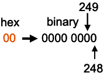
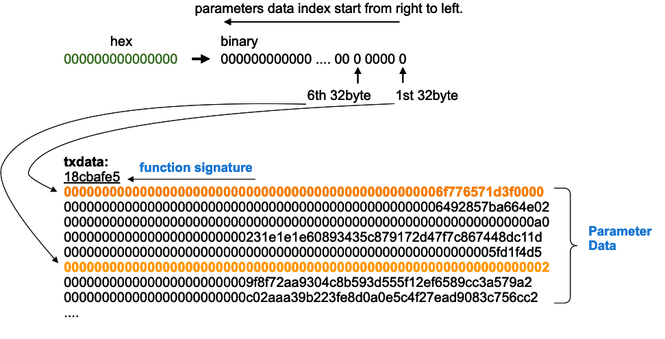
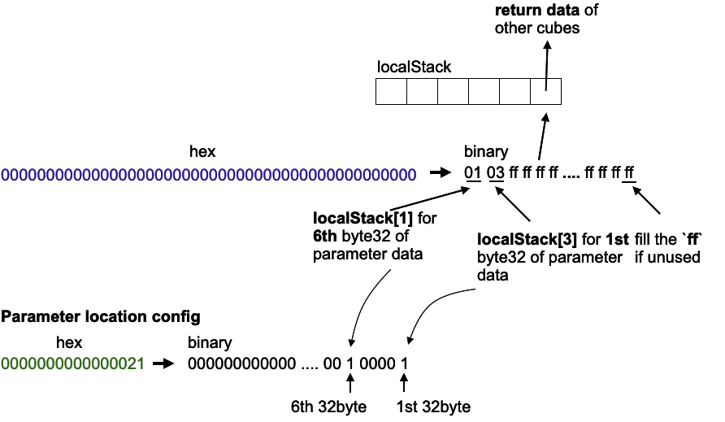
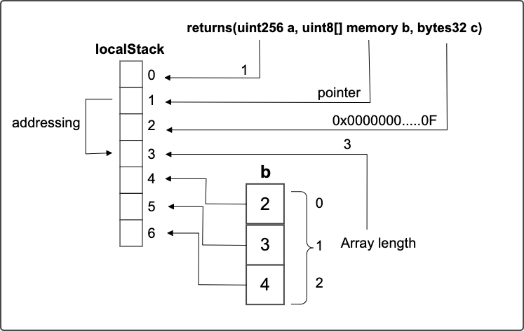

# Dynamic Cube Input Guideline

The details about dynamic cube input of Furucombo that includes config setup and common use cases. Please make sure to review the document.

## Structure
* Proxy
    * Storage
        * bytes32[] public stack;
        * mapping(bytes32 => bytes32) public cache;
    * Memory
        * bytes32[] memory localStack;
            * Store return data stack.
* Config
    * bytes32


## Config

config is bytes32 data represent by hex.


- ### Param config
    -  
    - `255-248` bits reserved for Param config
    - `248`: 1 if the parameter is dynamic, 0 if the parameter is static.
    - `249`: 1 if the return data will be referenced, 0 if not.
    - Example:
        - `0x00` => `(b00)`: static parameter.
        - `0x01` => `(b01)`: dynamic parameter.
        - `0x02` => `(b10)`: return data will be referenced.
        - `0x03` => `(b11)`: dynamic parameter and return data will be referenced.

- ### Parameter location
    - 
    - `247-184` bits reserved for Parameter location (total `64` bits).
    - Every bit locate the bytes (exclude 4-byte function signature) of dynamic parameter.
    - Support the function include maximum `64` parameters.
    - Example:
        - `0x01` => `(b001)` => replace the 1 preamter with dynamic parameter
        - `0x03` => `(b011)` => replace the 1, 2 preamters with dynamic parameter
        - `0x04` => `(b100)` => replace the 1, 3 preamter with dynamic parameter

- ### Reference location
    - 
    -  `183-0` bits reserved for Reference location (total: `184` bits).
    - Support max `23` dynamic parameters replacement.
    - Every `byte` give the location of localStack which contains the return values
    - Should be `ff` if the location is not used
    - Dynamic parameter replacement order is from right to left except `ff`.


## Common Cases

- Static config
  - `0x0000000000000000000000000000000000000000000000000000000000000000`
- Referenced, static parameter config
  - `0x0200000000000000000000000000000000000000000000000000000000000000`
- Not referenced, dynamic on second byte32, referencing localStack[0]
  - `0x01000000000000000200ffffffffffffffffffffffffffffffffffffffffffff`

## Dynamic Array Parameters
Dynamic array includes **2** extra data(pointer and array length) except data. It will store pointer and array length to localStack at the first.



**Dynamic Array Data**

```
0000000000000000000000000000000000000000000000000000000000000020 // array pointer
0000000000000000000000000000000000000000000000000000000000000003 // array length
0000000000000000000000000000000000000000000000000de0b6b3a7640000 // array[0]
0000000000000000000000000000000000000000000000000de0b6b3a7640000 // array[1]
0000000000000000000000000000000000000000000000000de0b6b3a7640000 // array[2]
```


**Example**

The localStack index must start from [**+2**] if using dynamic array return. For example, if you want to replace the **1st** parameter with the **2nd** of return dynamic array data. The localStack index will be start from 1(array[0]=pointer, array[1]=length), replace 1st parameter with localStack[3] (`1+2=3`).

* Config:  `0x01000000000000000203ffffffffffffffffffffffffffffffffffffffffffff`

## Percentage of dynamic parameter
`dynamic parameter = return data * percentage, 0 < percentage <= 1`


Replace the original parameter with **fraction** if using a dynamic parameter. The fraction will be divided by `ether(1)` for getting the **percentage** of return data.
* fraction
    * `uint256` type
    * denominator is `ether(1)`
    * `0 < fraction <= ether(1)`


**Example**
* Replace second parameter with 50% of return data.
    * `function bar(a, ether(0.5), c)`
* Replace first parameter with 70% of return data.
    * `function bar(ether(0.7), b, c)`
* Replace first parameter with 100% of return data.
    * `function bar(ether(1), b, c)`


## Preparation before using dynamic parameter
* Know config setup detail
* Know every cube return data (type and count)
* Know the index of all return data in localStack
* Know which cube return data will be reference
* Know which cube need to use dynamic parameter and which return data will be referenced
